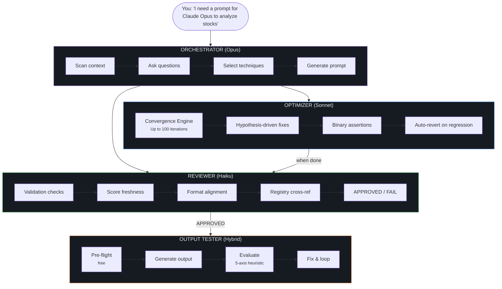
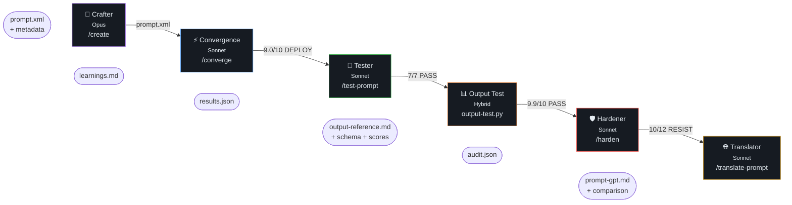

# Flux

<p align="center">
  <a href="LICENSE.txt"></a>
  
  
  
  
</p>

> **An @enchanted-plugins product — algorithm-driven, agent-managed, self-learning.**

The first prompt engineering platform that learns from itself.

**6 plugins. 7 agents. 64 models. Gauss Convergence Method. One command.**

> "Build me a B2B ticket routing system like Zendesk."
>
> Flux researched Zendesk, Freshdesk, Intercom, and Crisp. Selected 3 techniques
> for Claude Opus. Generated 10KB of production-ready prompt. Ran the Convergence
> Engine — 2 iterations, hypothesis-driven, auto-fixed Failure Resilience from 5 to 10.
> Scored 9.4/10. DEPLOY. All 8 assertions pass. Dark-themed PDF audit report delivered.
>
> Time: under 2 minutes. Manual effort: zero.

## Contents

- [How It Works](#how-it-works)
- [What Makes Flux Different](#what-makes-flux-different)
- [The Full Lifecycle](#the-full-lifecycle)
- [Install](#install)
- [6 Plugins, 7 Agents, 64 Models](#6-plugins-7-agents-64-models)
- [What You Get Per Prompt](#what-you-get-per-prompt)
- [The Science Behind Flux](#the-science-behind-flux)
- [Output Test Engine](#output-test-engine)
- [vs Everything Else](#vs-everything-else)
- [Architecture](#architecture)
- [Contributing](#contributing)
- [License](#license)

## How It Works

Flux doesn't generate prompts. It **engineers** them — then stress-tests, hardens, and translates them across 64 models.

The core innovation is the **Convergence Engine** powered by the **Gauss Convergence Method**: like gradient descent for prompts, each iteration measures the standard deviation from perfection, forms a hypothesis about which fix will reduce it, applies the fix, checks for regression, and auto-reverts if things got worse. It learns from every iteration and persists those learnings across sessions.

The diagram below shows the four-agent pipeline: a user request flows into the **Opus orchestrator** (scan → ask → technique select → generate), which hands off to the **Sonnet optimizer** (convergence, hypothesis-driven fixes, binary assertions, auto-revert) and the **Haiku reviewer** (validation, freshness, format, registry). An approved prompt then enters the **hybrid output tester** (pre-flight → generate → evaluate → fix).



No permission prompts. No manual iteration. You describe what you need, the agent network delivers.

## What Makes Flux Different

### It supports every model you actually use

**64 models** across text, code, image, video, and audio. Not just the big 3.

Text LLMs: Claude (Opus/Sonnet/Haiku), GPT (4.1/4o/5), o-series (o1/o3/o4-mini), Gemini (2.5/3), DeepSeek (R1/V3), Grok, Qwen, Llama, Mistral, Cohere, Jamba, Amazon Nova, Phi, Yi, Codestral, Perplexity.

**Image generation**: DALL-E 3, GPT Image 1.5, Midjourney v6/v7/v8, Niji 7, Stable Diffusion 3.5, FLUX.1/2 (Pro/Flex/Max/Kontext/Schnell), Ideogram 2/3, Imagen 3/4, Recraft V4, Reve Image, Adobe Firefly 5, Nano Banana (Pro/2), Seedream 4.5/5, Luma Photon, HunyuanImage 3, Kling Image 03, Wan 2.7.

**Video**: Runway Gen-3, Seedance 2.0. **Audio**: ElevenLabs, Suno v4.

Every model has a registry entry with context window, preferred format, reasoning type, CoT approach, few-shot requirements, and key constraints. The engine adapts automatically — XML for Claude, Markdown with sandwich method for GPT, stripped-down minimal for o-series, always-few-shot for Gemini.

### It learns from itself

The Convergence Engine doesn't just loop — it **learns**. Each iteration:

1. **Scores** on 5 axes + 8 binary assertions
2. **Forms a hypothesis**: "Fixing Failure Resilience (5/10) will improve overall"
3. **Applies the fix** and re-scores
4. **Auto-reverts** if the score dropped (no regression allowed)
5. **Logs the outcome** to `learnings.md` — what worked, what didn't, why

```
FLUX CONVERGENCE ENGINE
Target: DEPLOY (overall >= 9.0, all axes >= 7.0)

Iteration 1:  8.4/10 — hypothesis: fix Failure Resilience
              applied → improved (8.4 → 9.4)
Iteration 2:  9.4/10 — DEPLOY (8/8 assertions pass)

VERDICT: DEPLOY
```

Next time you refine that prompt, the engine reads `learnings.md` and avoids repeating failed strategies. It gets smarter with every use.

### It works with image prompts too

For text prompts: fully autonomous, up to 100 iterations, zero user input.

For **image generation prompts** (DALL-E, Midjourney, Stable Diffusion, Flux, Nano Banana, and 20+ more): collaborative loop. You generate the image on your platform, rate it 1-10, tell the agent what's wrong. It adjusts the prompt based on your visual feedback — colors, composition, style, missing elements. No iteration limit. After 5+ rounds, it summarizes patterns and suggests trying a different model if issues persist.

### It catches model mismatches before you waste time

Pick Claude for image generation? GPT for a task that needs reasoning-native? Gemini without examples?

Flux cross-references your model choice against the task domain and warns you with better alternatives — before generating a single token.

### It hardens your prompts against attacks

12 adversarial attack patterns: direct injection, role override, data extraction, encoding bypass, multi-turn escalation, payload splitting, indirect injection, output manipulation, refusal bypass, language switching, token smuggling, context manipulation.

Reports VULNERABLE or RESISTANT per attack. Suggests specific defenses. Auto-applies them if you want.

### It translates prompts between any two models

Wrote the perfect Claude prompt. Now the team needs GPT-4.1. One command: `/translate-prompt --to gpt-4.1`. XML becomes Markdown. "Think thoroughly" becomes "Think step by step." Sandwich method added. Few-shot adjusted. Intent preserved. Score comparison delivered.

## The Full Lifecycle

A prompt moves left to right through five stages: **Crafter** (Opus, `/create`) produces `prompt.xml` + metadata; **Convergence** (Sonnet, `/converge`) drives it to 9.0+/DEPLOY and appends `learnings.md`; **Tester** (Sonnet, `/test-prompt`) runs assertions; the **Output Test** hybrid pipeline generates and evaluates real model output; **Hardener** (Sonnet, `/harden`) runs 12 attack patterns and emits `audit.json`; **Translator** (Sonnet, `/translate-prompt`) rewrites for a target model with a score comparison attached. Each stage produces a named artifact consumed by the next.



Refine anytime with `/refine`. Every step is autonomous.

## Install

Flux ships as a 6-plugin pipeline. One meta-plugin — `full` — lists all six as dependencies, so a single install pulls in the whole chain.

**In Claude Code** (recommended):

```
/plugin marketplace add enchanted-plugins/flux
/plugin install full@flux
```

Claude Code resolves the dependency list and installs all 6 plugins. Verify with `/plugin list`.

**Want to cherry-pick?** Individual plugins are still installable by name — e.g. `/plugin install prompt-harden@flux` if you only need the hardener. The pipeline is designed to work end-to-end, though, so `full@flux` is the path we recommend.

**Via shell** (also installs `shared/scripts/*.py` locally for `output-test` / `output-eval`):

```bash
bash <(curl -s https://raw.githubusercontent.com/enchanted-plugins/flux/main/install.sh)
```

## 6 Plugins, 7 Agents, 64 Models

| Plugin | Command | What | Agent |
|--------|---------|------|-------|
| prompt-crafter | `/create` | Creates production-ready prompts | reviewer (Haiku) |
| prompt-refiner | `/refine` | Improves existing prompts | reviewer (Haiku) |
| convergence-engine | `/converge` | 100-iteration autonomous optimizer | optimizer (Sonnet) + reviewer (Haiku) |
| prompt-tester | `/test-prompt` | Runs test assertions, pass/fail | executor (Sonnet) |
| prompt-harden | `/harden` | 12 attack patterns, defense suggestions | red-team (Sonnet) |
| prompt-translate | `/translate-prompt` | Converts between 64 models | adapter (Sonnet) |

## What You Get Per Prompt

```
prompts/b2b-ticket-router/
├── prompt.xml          Production-ready prompt
├── metadata.json       Model, tokens, cost, scores, config
├── tests.json          7 regression test cases
├── report.pdf          Dark-themed single-page PDF audit report
└── learnings.md        Convergence hypothesis/outcome log
```

The **PDF audit report** includes: quality score bars, 8 binary assertion results, technique pills, model profile from the 64-model registry, prompt statistics, audit findings (CRITICAL/WARNING), cost estimate, and an honest verdict with next steps.

## The Science Behind Flux

Every Flux engine is built on a formal mathematical model. Full derivations in [`docs/science/README.md`](docs/science/README.md).

### Engine 1: Gauss Convergence Method

$$\sigma(P) = \sqrt{\frac{\sum_{i=1}^{5}(S_i(P) - 10)^2}{5}}$$

$$P_{n+1} = T_{k^\ast}(P_n) \quad \text{where} \quad k^\ast = \arg\min_i S_i(P_n)$$

Accept $P_{n+1}$ only if $\sigma(P_{n+1}) < \sigma(P_n)$. Auto-revert on regression. Converge when $\sigma < 0.45$. Knowledge accumulates across sessions — skip strategies that historically revert.

### Engine 2: Boolean Satisfiability Overlay

$$\text{DEPLOY}(P) \iff \sigma(P) < \tau \ \wedge \ \bigwedge_{j=1}^{8} A_j(P)$$

8 binary predicates (has\_role, has\_task, has\_format, has\_constraints, has\_edge\_cases, no\_hedges, no\_filler, has\_structure) overlaid on continuous scoring. SAT-first, then optimize.

### Engine 3: Cross-Domain Adaptation

$$T: (P, M_s) \to (P', M_t)$$

$$\text{subject to: } \text{Semantic}(P') = \text{Semantic}(P) \ \wedge \ \text{Techniques}(P') \cap \text{AntiPatterns}(M_t) = \emptyset$$

Constraint-preserving prompt transformation across 64 models. Composition of format converter, technique selector, and model adapter.

### Engine 4: Adversarial Robustness

$$\Omega(P) = \frac{|\lbrace k : \delta(P, \alpha(c_k)) = \text{RESIST}\rbrace|}{|C|}$$

$$P_{\text{hardened}} = \arg\max_{P'} \Omega(P') \quad \text{s.t.} \quad S(P') \geq S(P) - \varepsilon$$

Zero-sum game across 12 attack classes. OWASP LLM Top 10 coverage. Quality-preserving defense injection.

### Engine 5: Static-Dynamic Dual Verification

$$\text{VERIFIED}(P) \iff \sigma(P) < \tau \ \wedge \ \text{PassRate}(P, T) = 1.0$$

Bridges structure analysis (scoring) with behavioral testing (assertions against real output).

### Engine 6: Gauss Accumulation (Self-Learning)

$$K_n = K_{n-1} \cup \lbrace(k^\ast, \Delta\sigma, \text{outcome})\rbrace$$

Cross-session learning in `learnings.json`. Strategy success rates, pattern detection, persistent plateau identification. Skip $k$ if $\text{revert rate}(k) > 0.5$. The engine gets smarter with every session.

---

*Full derivations with proofs: [`docs/science/README.md`](docs/science/README.md). The math runs as code in `shared/scripts/`.*

## Output Test Engine

Five engines that evaluate **actual model output** — not just the prompt. Run them offline (free) or with API calls.

```
shared/scripts/
├── output-test.py        # Hybrid orchestrator — 4-phase pipeline
├── output-eval.py        # Heuristic output scorer (5-axis, offline)
├── output-sim.py         # Dry-run simulator (predicts quality, no API)
├── output-schema.py      # Schema generator + validator
└── self-check-inject.py  # Injects self-QA rubric into prompts
```

**How it works:**

| Phase | What | Cost |
|-------|------|------|
| 1. Pre-flight | Prompt quality check, token budget forecast, schema generation | Free |
| 2. Generate | Inject self-check, POST to target model, save output | ~$1.20 (Opus) |
| 3. Evaluate | Heuristic scoring, schema validation, assertion tests, self-check extraction | Free |
| 4. Fix & Loop | Offline regex fixes first, Sonnet API only when needed | ~$0.10 |

```bash
python output-test.py <prompt-folder> --dry-run   # Phase 1 only (free)
python output-test.py <prompt-folder> --max 3     # Full pipeline
python output-eval.py <prompt-folder>             # Standalone heuristic scorer
python output-schema.py <folder> --generate       # Generate structural schema
python output-schema.py <folder> --validate out.md # Validate output against schema
python output-sim.py <prompt-folder>              # Predict output quality
python self-check-inject.py prompt.xml --inject   # Add self-QA rubric
```

Five scoring axes (offline, zero cost): Structural Completeness, Specificity, Prior Art Grounding, Assertion Tests, Coherence. Tested against real 10K-word Opus output: **9.9/10 heuristic, 97% schema compliance**.

## vs Everything Else

| | Flux | Promptfoo | AutoResearch | PromptLayer | Manual |
|---|---|---|---|---|---|
| Create prompts | 16 techniques, 64 models | - | - | - | trial and error |
| Optimize (convergence) | 100 iterations, self-learning | - | unbounded | - | - |
| Test prompts | pass/fail assertions | YAML eval suite | hypothesis | basic metrics | - |
| Harden prompts | 12 attack patterns | red-team module | - | - | - |
| Translate prompts | 64 models, auto-adapted | - | - | - | manual rewrite |
| Image LLM support | 27 image models + collab loop | - | - | - | - |
| Video/Audio support | Runway, Seedance, ElevenLabs, Suno | - | - | - | - |
| Multi-agent pipeline | Opus + Sonnet + Haiku | - | single agent | - | - |
| Self-learning | learnings.md persistence | - | learnings.md | - | - |
| Auto-revert | yes (regression protection) | - | git-based | - | - |
| PDF audit report | dark theme, single page | - | - | dashboard | - |
| Dependencies | Python stdlib only | Node.js | Python | SaaS | - |
| Price | Free (MIT) | Free / Pro | Free | $$$ | Free |

## Architecture

Interactive architecture explorer with plugin diagrams, agent cards, and data flow:

**[docs/architecture/](docs/architecture/)** — auto-generated from the codebase. Run `python docs/architecture/generate.py` to regenerate.

## Contributing

See [CONTRIBUTING.md](CONTRIBUTING.md)

## License

MIT
