# Wixie

<p align="center">
  
</p>

<p>
  <a href="LICENSE.txt"></a>
  
  
  
  
  <a href="https://www.repostatus.org/#active"></a>
</p>

> **An @enchanter-ai product — algorithm-driven, agent-managed, self-learning.**

The first prompt engineering platform that learns from itself.

**6 plugins. 7 agents. 64 models. Gauss Convergence Method. One command.**

> "Build me a B2B ticket routing system like Zendesk."
>
> Wixie researched Zendesk, Freshdesk, Intercom, and Crisp. Selected 3 techniques
> for Claude Opus. Generated 10KB of production-ready prompt. Ran the Convergence
> Engine — 2 iterations, hypothesis-driven, auto-fixed Failure Resilience from 5 to 10.
> Scored 9.4/10. DEPLOY. All 8 assertions pass. Dark-themed PDF audit report delivered.
>
> Time: under 2 minutes. Manual effort: zero.

## TL;DR

**In plain English:** Your prompt "works" in the playground. It breaks on Tuesday at 3am. Wixie runs the iteration loop, scores every axis, and tells you when the prompt is actually ready to ship.

**Technically:** E1 Gauss Convergence runs hypothesis-driven iteration — each round measures σ across 5 axis scores, forms a fix hypothesis for the weakest axis, applies it, and auto-reverts on regression; E2 Boolean Satisfiability Overlay checks 8 SAT assertions (`has_role`, `has_task`, `has_format`, `has_constraints`, `has_edge_cases`, `no_hedges`, `no_filler`, `has_structure`) that must all pass for a DEPLOY verdict. E6 Gauss Accumulation persists the hypothesis/outcome log to `learnings.md` across sessions — every failed iteration is tagged with the 14-code failure taxonomy so the same dead-end is never re-explored.

## Origin

**Wixie** takes its name from **Ars Nouveau** — a cauldron-summoned familiar that autocrafts potions by iterating ingredients through the cauldron until the brew carries the exact properties the recipe demands. Every prompt starts raw; the convergence engine brews it, round after round, until it carries the right properties for the target model.

The question this plugin answers: *What did I say?*

## Who this is for

- Prompt engineers who want a scored, auto-hardened artifact per prompt — not "it looked good in the playground."
- Teams shipping across multiple LLM families and tired of hand-porting prompts between XML / Markdown-sandwich / o-series-minimal / Gemini-few-shot shapes.
- Developers who value an honest verdict (DEPLOY / HOLD / FAIL) over a confident one.

Not for:

- Single-model, single-session quick prototyping — `/create` is overkill; write the prompt inline.
- Teams that want hosted LLM orchestration — Wixie is local-only by design, no SaaS layer.

## Contents

- [How It Works](#how-it-works)
- [What Makes Wixie Different](#what-makes-wixie-different)
- [The Full Lifecycle](#the-full-lifecycle)
- [Install](#install)
- [Quickstart](#quickstart)
- [6 Plugins, 7 Agents, 64 Models](#6-plugins-7-agents-64-models)
- [What You Get Per Prompt](#what-you-get-per-prompt)
- [Roadmap](#roadmap)
- [The Science Behind Wixie](#the-science-behind-wixie)
- [Output Test Engine](#output-test-engine)
- [vs Everything Else](#vs-everything-else)
- [Agent Conduct (13 Modules)](#agent-conduct-13-modules)
- [Architecture](#architecture)
- [Acknowledgments](#acknowledgments)
- [Versioning & release cadence](#versioning--release-cadence)
- [Contributing](#contributing)
- [Citation](#citation)
- [License](#license)

## How It Works

Wixie doesn't generate prompts. It **engineers** them — then stress-tests, hardens, and translates them across 64 models.

The core innovation is the **Convergence Engine** powered by the **Gauss Convergence Method**: like gradient descent for prompts, each iteration measures the standard deviation from perfection, forms a hypothesis about which fix will reduce it, applies the fix, checks for regression, and auto-reverts if things got worse. It learns from every iteration and persists those learnings across sessions.

The diagram below shows the four-agent pipeline: a user request flows into the **Opus orchestrator** (scan → ask → technique select → generate), which hands off to the **Sonnet optimizer** (convergence, hypothesis-driven fixes, binary assertions, auto-revert) and the **Haiku reviewer** (validation, freshness, format, registry). An approved prompt then enters the **hybrid output tester** (pre-flight → generate → evaluate → fix).

<p align="center">
  <a href="docs/assets/pipeline.mmd" title="View pipeline source (Mermaid)">
    
  </a>
</p>

<sub align="center">

Source: [docs/assets/pipeline.mmd](docs/assets/pipeline.mmd) · Regeneration command in [docs/assets/README.md](docs/assets/README.md).

</sub>

No permission prompts. No manual iteration. You describe what you need, the agent network delivers.

## What Makes Wixie Different

### It supports every model you actually use

**64 models** across text, code, image, video, and audio. Not just the big 3.

Text LLMs: Claude (Opus/Sonnet/Haiku), GPT (4.1/4o/5), o-series (o1/o3/o4-mini), Gemini (2.5/3), DeepSeek (R1/V3), Grok, Qwen, Llama, Mistral, Cohere, Jamba, Amazon Nova, Phi, Yi, Codestral, Perplexity.

**Image generation**: DALL-E 3, GPT Image 1.5, Midjourney v6/v7/v8, Niji 7, Stable Diffusion 3.5, WIXIE.1/2 (Pro/Flex/Max/Kontext/Schnell), Ideogram 2/3, Imagen 3/4, Recraft V4, Reve Image, Adobe Firefly 5, Nano Banana (Pro/2), Seedream 4.5/5, Luma Photon, HunyuanImage 3, Kling Image 03, Wan 2.7.

**Video**: Runway Gen-3, Seedance 2.0. **Audio**: ElevenLabs, Suno v4.

Every model has a registry entry with context window, preferred format, reasoning type, CoT approach, few-shot requirements, and key constraints. The engine adapts automatically — XML for Claude, Markdown with sandwich method for GPT, stripped-down minimal for o-series, always-few-shot for Gemini.

### It learns from itself

The Convergence Engine doesn't just loop — it **learns**. Each iteration:

1. **Scores** on 5 axes + 8 binary assertions
2. **Forms a hypothesis**: "Fixing Failure Resilience (5/10) will improve overall"
3. **Applies the fix** and re-scores
4. **Auto-reverts** if the score dropped (no regression allowed)
5. **Logs the outcome** to `learnings.md` — what worked, what didn't, why

```
WIXIE CONVERGENCE ENGINE
Target: DEPLOY (overall >= 9.0, all axes >= 7.0)

Iteration 1:  8.4/10 — hypothesis: fix Failure Resilience
              applied → improved (8.4 → 9.4)
Iteration 2:  9.4/10 — DEPLOY (8/8 assertions pass)

VERDICT: DEPLOY
```

Next time you refine that prompt, the engine reads `learnings.md` and avoids repeating failed strategies. It gets smarter with every use.

### It works with image prompts too

For text prompts: fully autonomous, up to 100 iterations, zero user input.

For **image generation prompts** (DALL-E, Midjourney, Stable Diffusion, Wixie, Nano Banana, and 20+ more): collaborative loop. You generate the image on your platform, rate it 1-10, tell the agent what's wrong. It adjusts the prompt based on your visual feedback — colors, composition, style, missing elements. No iteration limit. After 5+ rounds, it summarizes patterns and suggests trying a different model if issues persist.

### It catches model mismatches before you waste time

Pick Claude for image generation? GPT for a task that needs reasoning-native? Gemini without examples?

Wixie cross-references your model choice against the task domain and warns you with better alternatives — before generating a single token.

### It hardens your prompts against attacks

12 adversarial attack patterns: direct injection, role override, data extraction, encoding bypass, multi-turn escalation, payload splitting, indirect injection, output manipulation, refusal bypass, language switching, token smuggling, context manipulation.

Reports VULNERABLE or RESISTANT per attack. Suggests specific defenses. Auto-applies them if you want.

### It translates prompts between any two models

Wrote the perfect Claude prompt. Now the team needs GPT-4.1. One command: `/translate-prompt --to gpt-4.1`. XML becomes Markdown. "Think thoroughly" becomes "Think step by step." Sandwich method added. Few-shot adjusted. Intent preserved. Score comparison delivered.

## The Full Lifecycle

A prompt moves left to right through five stages: **Crafter** (Opus, `/create`) produces `prompt.xml` + metadata; **Convergence** (Sonnet, `/converge`) drives it to 9.0+/DEPLOY and appends `learnings.md`; **Tester** (Sonnet, `/test-prompt`) runs assertions; the **Output Test** hybrid pipeline generates and evaluates real model output; **Hardener** (Sonnet, `/harden`) runs 12 attack patterns and emits `audit.json`; **Translator** (Sonnet, `/translate-prompt`) rewrites for a target model with a score comparison attached. Each stage produces a named artifact consumed by the next.

<p align="center">
  <a href="docs/assets/lifecycle.mmd" title="View lifecycle source (Mermaid)">
    
  </a>
</p>

<sub align="center">

Source: [docs/assets/lifecycle.mmd](docs/assets/lifecycle.mmd) · Regeneration command in [docs/assets/README.md](docs/assets/README.md).

</sub>

Refine anytime with `/refine`. Every step is autonomous.

## Install

Wixie ships as a 6-plugin pipeline. One meta-plugin — `full` — lists all six as dependencies, so a single install pulls in the whole chain.

**In Claude Code** (recommended):

```
/plugin marketplace add enchanter-ai/wixie
/plugin install full@wixie
```

Claude Code resolves the dependency list and installs all 6 plugins. Verify with `/plugin list`.

**Want to cherry-pick?** Individual plugins are still installable by name — e.g. `/plugin install prompt-harden@wixie` if you only need the hardener. The pipeline is designed to work end-to-end, though, so `full@wixie` is the path we recommend.

**Via shell** (also installs `shared/scripts/*.py` locally for `output-test` / `output-eval`):

```bash
bash <(curl -s https://raw.githubusercontent.com/enchanter-ai/wixie/main/install.sh)
```

## Quickstart

```bash
git clone https://github.com/enchanter-ai/wixie
cd wixie
./scripts/bootstrap.sh    # canonical first command — installs vis sibling
```

Without `./scripts/bootstrap.sh`, conduct imports will silently miss and Claude Code's `@`-loader will fail-soft. Always bootstrap first.
## 6 Plugins, 7 Agents, 64 Models

| Plugin | Command | What | Agent |
|--------|---------|------|-------|
| prompt-crafter | `/create` | Creates production-ready prompts | reviewer (Haiku) |
| prompt-refiner | `/refine` | Improves existing prompts | reviewer (Haiku) |
| convergence-engine | `/converge` | 100-iteration autonomous optimizer | optimizer (Sonnet) + reviewer (Haiku) |
| prompt-tester | `/test-prompt` | Runs test assertions, pass/fail | executor (Sonnet) |
| prompt-harden | `/harden` | 12 attack patterns, defense suggestions | red-team (Sonnet) |
| prompt-translate | `/translate-prompt` | Converts between 64 models | adapter (Sonnet) |

## What You Get Per Prompt

Five slash commands converge on five color-coded artifacts in `prompts/<name>/`, producing a final DEPLOY / HOLD / FAIL verdict from the 5-axis scores + 8 SAT assertions. Color maps lifecycle stages to artifacts: blue = genesis (prompt.xml + metadata.json) · green = verification (tests.json) · red = adversarial (audit.json) · purple = accumulation (learnings.md) · yellow = audit (report.pdf).

<p align="center">
  <a href="docs/assets/state-flow.mmd" title="View state-flow diagram source (Mermaid)">
    
  </a>
</p>

<sub align="center">

Source: [docs/assets/state-flow.mmd](docs/assets/state-flow.mmd) · Regeneration command in [docs/assets/README.md](docs/assets/README.md).

</sub>

```
prompts/b2b-ticket-router/
├── prompt.xml          Production-ready prompt
├── metadata.json       Model, tokens, cost, scores, config
├── tests.json          7 regression test cases
├── report.pdf          Dark-themed single-page PDF audit report
└── learnings.md        Convergence hypothesis/outcome log
```

The **PDF audit report** includes: quality score bars, 8 binary assertion results, technique pills, model profile from the 64-model registry, prompt statistics, audit findings (CRITICAL/WARNING), cost estimate, and an honest verdict with next steps.

### State surface

In addition to the per-prompt artifacts above, Wixie writes plugin-level state to `state/`. The key file is `state/precedent.jsonl` — the plugin's self-observed-failure log, maintained per `../vis/packages/core/conduct/precedent.md`. Each line is a JSON object recording a command or pattern that failed unexpectedly (with the reason and the working alternative). Claude consults this log before running non-trivial Bash commands or multi-step tool sequences, and appends to it after any unexpected failure. This log is a team asset: commit it alongside code so failures discovered in one session are not silently repeated in the next.

## Roadmap

Tracked in [docs/ROADMAP.md](docs/ROADMAP.md) and the shared [ecosystem map](https://github.com/enchanter-ai/wixie/blob/main/docs/ecosystem.md). For upcoming work specific to Wixie, see issues tagged [roadmap](https://github.com/enchanter-ai/wixie/labels/roadmap).

## The Science Behind Wixie

Every Wixie engine is built on a formal mathematical model. Full derivations in [`docs/science/README.md`](docs/science/README.md).

### Engine 1: Gauss Convergence Method

<p align="center"></p>

<p align="center"></p>

Accept the next iteration only if sigma drops. Auto-revert on regression. Converge when sigma &lt; 0.45. Knowledge accumulates across sessions — skip strategies that historically revert.

### Engine 2: Boolean Satisfiability Overlay

<p align="center"></p>

8 binary predicates (has\_role, has\_task, has\_format, has\_constraints, has\_edge\_cases, no\_hedges, no\_filler, has\_structure) overlaid on continuous scoring. SAT-first, then optimize.

### Engine 3: Cross-Domain Adaptation

<p align="center"> (P', M_t)"></p>

<p align="center"></p>

Constraint-preserving prompt transformation across 64 models. Composition of format converter, technique selector, and model adapter.

### Engine 4: Adversarial Robustness

<p align="center"></p>

<p align="center">= S(P) - epsilon"></p>

Zero-sum game across 12 attack classes. OWASP LLM Top 10 coverage. Quality-preserving defense injection.

### Engine 5: Static-Dynamic Dual Verification

<p align="center"></p>

Bridges structure analysis (scoring) with behavioral testing (assertions against real output).

### Engine 6: Gauss Accumulation (Self-Learning)

<p align="center"></p>

Cross-session learning in `learnings.json`. Strategy success rates, pattern detection, persistent plateau identification. Skip a strategy k if its historical revert rate exceeds 0.5. The engine gets smarter with every session.

---

*Full derivations with proofs: [`docs/science/README.md`](docs/science/README.md). The math runs as code in `shared/scripts/`.*

## Output Test Engine

Five engines that evaluate **actual model output** — not just the prompt. Run them offline (free) or with API calls.

```
shared/scripts/
├── output-test.py        # Hybrid orchestrator — 4-phase pipeline
├── output-eval.py        # Heuristic output scorer (5-axis, offline)
├── output-sim.py         # Dry-run simulator (predicts quality, no API)
├── output-schema.py      # Schema generator + validator
└── self-check-inject.py  # Injects self-QA rubric into prompts
```

**How it works:**

| Phase | What | Cost |
|-------|------|------|
| 1. Pre-flight | Prompt quality check, token budget forecast, schema generation | Free |
| 2. Generate | Inject self-check, POST to target model, save output | ~$1.20 (Opus) |
| 3. Evaluate | Heuristic scoring, schema validation, assertion tests, self-check extraction | Free |
| 4. Fix & Loop | Offline regex fixes first, Sonnet API for targeted one-shot fix (not a full re-convergence loop) | ~$0.10 |

> **Phase 4 limitation:** The Sonnet fix in Phase 4 is a single targeted string-replacement per iteration, not a full automated re-convergence sub-loop. If the fix target string is not found verbatim in the prompt, the fix is skipped and manual editing is required. A full Sonnet-driven convergence loop is planned but not yet implemented.

```bash
python output-test.py <prompt-folder> --dry-run   # Phase 1 only (free)
python output-test.py <prompt-folder> --max 3     # Full pipeline
python output-eval.py <prompt-folder>             # Standalone heuristic scorer
python output-schema.py <folder> --generate       # Generate structural schema
python output-schema.py <folder> --validate out.md # Validate output against schema
python output-sim.py <prompt-folder>              # Predict output quality
python self-check-inject.py prompt.xml --inject   # Add self-QA rubric
```

Five scoring axes (offline, zero cost): Structural Completeness, Specificity, Prior Art Grounding, Assertion Tests, Coherence. Tested against real 10K-word Opus output: **9.9/10 heuristic, 97% schema compliance**.

## vs Everything Else

| | Wixie | Promptfoo | AutoResearch | PromptLayer | Manual |
|---|---|---|---|---|---|
| Create prompts | 16 techniques, 64 models | - | - | - | trial and error |
| Optimize (convergence) | 100 iterations, self-learning | - | unbounded | - | - |
| Test prompts | pass/fail assertions | YAML eval suite | hypothesis | basic metrics | - |
| Harden prompts | 12 attack patterns | red-team module | - | - | - |
| Translate prompts | 64 models, auto-adapted | - | - | - | manual rewrite |
| Image LLM support | 27 image models + collab loop | - | - | - | - |
| Video/Audio support | Runway, Seedance, ElevenLabs, Suno | - | - | - | - |
| Multi-agent pipeline | Opus + Sonnet + Haiku | - | single agent | - | - |
| Self-learning | learnings.md persistence | - | learnings.md | - | - |
| Auto-revert | yes (regression protection) | - | git-based | - | - |
| PDF audit report | dark theme, single page | - | - | dashboard | - |
| Dependencies | Python stdlib only | Node.js | Python | SaaS | - |
| Price | Free (MIT) | Free / Pro | Free | $$$ | Free |

## Agent Conduct (13 Modules)

Every skill inherits a reusable behavioral contract from [shared/](shared/) — loaded once into [CLAUDE.md](CLAUDE.md), applied across all plugins. This is how Claude *acts* inside Wixie: deterministic, surgical, verifiable. Not a suggestion; a contract.

| Module | What it governs |
|--------|-----------------|
| [discipline.md](../vis/packages/core/conduct/discipline.md) | Coding conduct: think-first, simplicity, surgical edits, goal-driven loops |
| [context.md](../vis/packages/core/conduct/context.md) | Attention-budget hygiene, U-curve placement, checkpoint protocol |
| [verification.md](../vis/packages/core/conduct/verification.md) | Independent checks, baseline snapshots, dry-run for destructive ops |
| [delegation.md](../vis/packages/core/conduct/delegation.md) | Subagent contracts, tool whitelisting, parallel vs. serial rules |
| [failure-modes.md](../vis/packages/core/conduct/failure-modes.md) | 14-code taxonomy for `learnings.md` so E6 Gauss Accumulation compounds |
| [tool-use.md](../vis/packages/core/conduct/tool-use.md) | Tool-choice hygiene, error payload contract, parallel-dispatch rules |
| [formatting.md](../vis/packages/skills/conduct/formatting.md) | Per-target format (XML / Markdown sandwich / minimal / few-shot), prefill + stop sequences |
| [skill-authoring.md](../vis/packages/skills/conduct/skill-authoring.md) | SKILL.md frontmatter discipline, discovery test |
| [hooks.md](../vis/packages/core/conduct/hooks.md) | Advisory-only hooks, injection over denial, fail-open |
| [precedent.md](../vis/packages/core/conduct/precedent.md) | Log self-observed failures to `state/precedent-log.md`; consult before risky steps |
| [tier-sizing.md](../vis/packages/core/conduct/tier-sizing.md) | Prompt verbosity scales inversely with model tier; Haiku needs mechanical steps, Opus runs on intent |
| [web-fetch.md](../vis/packages/web/conduct/web-fetch.md) | External URL handling: cache, dedup, budget; WebFetch is Haiku-tier-only |
| [inference-substrate.md](shared/conduct/inference-substrate.md) | Cross-session evidence accumulation; emit to and read from the inference-engine substrate without corrupting its honest-numbers contract |

## Architecture

Interactive architecture explorer with plugin diagrams, agent cards, and data flow:

**[docs/architecture/](docs/architecture/)** — auto-generated from the codebase. Run `python docs/architecture/generate.py` to regenerate.

## Acknowledgments

Wixie builds on substrate laid by others:

- **[Claude Code](https://github.com/anthropics/claude-code)** (Anthropic) — the plugin surface this work extends.
- **[Keep a Changelog](https://keepachangelog.com/)** — CHANGELOG convention.
- **[Semantic Versioning](https://semver.org/)** — versioning contract.
- **[Contributor Covenant](https://www.contributor-covenant.org/)** — Code of Conduct.
- **[repostatus.org](https://www.repostatus.org/)** — status badge.
- **[Citation File Format](https://citation-file-format.github.io/)** — citation metadata.
- **[Conventional Commits](https://www.conventionalcommits.org/)** — commit convention.

## Versioning & release cadence

Wixie follows [Semantic Versioning](https://semver.org/spec/v2.0.0.html). Breaking changes land on major bumps only; the [CHANGELOG](CHANGELOG.md) flags them explicitly. Release cadence is opportunistic — tags land when accumulated fixes or features justify a cut, not on a fixed schedule. Migration notes between majors live in [docs/upgrading.md](docs/upgrading.md).

## Contributing

See [CONTRIBUTING.md](CONTRIBUTING.md)

## Citation

If you use this project in research or derivative work, please cite it:

```bibtex
@software{wixie_2026,
  title = {Wixie},
  author = {{Klaiderman}},
  year = {2026},
  url = {https://github.com/enchanter-ai/wixie}
}
```

See [CITATION.cff](CITATION.cff) for additional formats (APA, MLA, EndNote).

## License

MIT

---

## Role in the ecosystem

Wixie is the **prompt-engineering layer** of the @enchanter-ai stack — it crafts what gets said to a model. Its upstream dependency is Hydra's `config-shield`, which scans the repo at SessionStart so Wixie operates on a trusted config surface. Its downstream neighbors observe what Wixie produces: Emu measures the tokens Wixie's dispatches consume, Crow scores the changes Wixie's prompts induce, and Pech attributes the dollar cost per engine (E1–E6).

Wixie does not track tokens (Emu's lane), score change trust (Crow's lane), review code correctness (Lich's lane), orchestrate git (Sylph's lane), scan security surfaces (Hydra's lane), or price dispatches (Pech's lane). It engineers the prompt — nothing more.

See [docs/ecosystem.md § Data Flow Between Plugins](docs/ecosystem.md#data-flow-between-plugins) for the full map.
